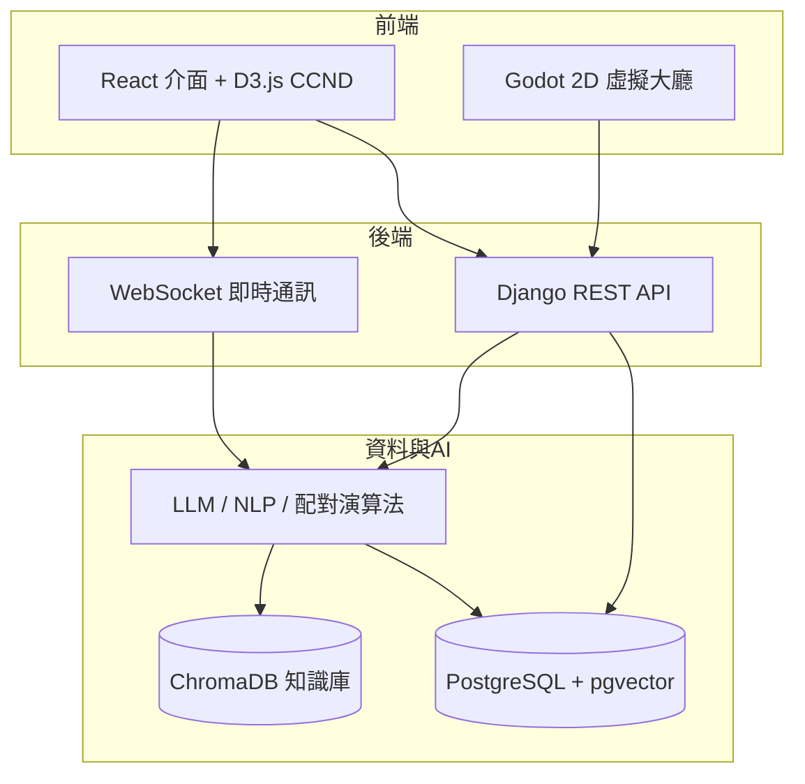
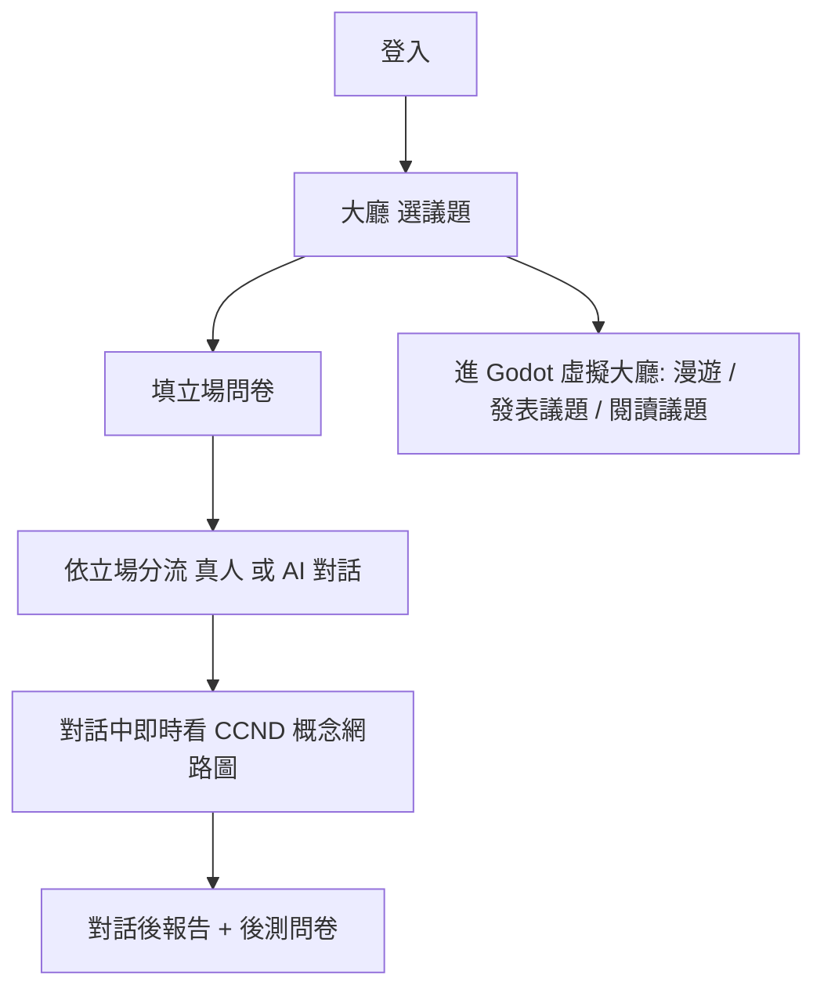

# 系統整體介紹

這份是整個平台的高層次介紹，讓人理解我負責的前端與 Godot 接在哪。各模組標示團隊分工。

## 團隊分工

| 成員 | 定位 | 負責 |
|---|---|---|
| 賴則名 | PM／系統架構 | 系統架構、H-AI 對話代理人（Prompt／RAG／API）、H-H 對話模組（WebSocket、情緒／敏感詞／離題分析、AI 改寫）、問卷設計、CCND 架構、觀點知識庫規範 |
| 伍晨安 | 後端開發 | 前後端整合、後端 API、測試伺服器、系統除錯 |
| 黃筱筑 | 機器學習／測試 | 問卷計分方式、CCND 機器學習方法研究、測試優化 |
| **陳彩希（我）** | **前端開發** | **前端介面、Godot 虛擬大廳** |
| 葉錦諦 | 資料工程 | RAG 資料爬取、觀點知識庫架構與內容 |

---

## 系統架構

前端（我）透過 HTTP／WebSocket 與後端溝通；後端處理配對、對話、AI 分析與資料儲存。

---

## 模組功能一覽

| 模組 | 功能簡述 | 主要負責 |
|---|---|---|
| 使用者管理 | 帳號註冊登入、JWT 驗證、匿名機制 | 伍晨安 |
| 議題與立場量測 | 選議題、填立場問卷、計算立場分數與語義向量 | 賴則名（問卷）／黃筱筑（計分）|
| 異質配對 | 依立場把最對立的兩人配在一起，或配對立 AI | 賴則名 |
| H-H 對話 | 真人即時對話 + 情緒／離題／僵局等即時提示 | 賴則名 |
| H-AI 對話 | AI 代理人以對立立場、RAG 引用資料與使用者對話 | 賴則名 |
| CCND 概念網路圖 | 從對話擷取概念、算語義距離、力導向圖呈現 | 賴則名（架構）／黃筱筑（ML）／**陳彩希（前端呈現）** |
| 對話後報告 | 立場偏移量、情緒變化等量化報告 + 後測問卷 | 賴則名 |
| 觀點知識庫 | 篩選高品質對話沉澱成可檢索的知識庫 | 葉錦諦 |
| **虛擬大廳** | **像素風 2D 多人空間：漫遊、發表議題、閱讀議題** | **陳彩希（我）** |

---

## 使用者流程（高層次）

> 我負責的是前端各頁面的呈現（含 CCND 的 D3 視覺化）與 Godot 虛擬大廳；其餘模組如上表對應到各組員。功能面的簡述見 [API.md](./API.md)、[DATABASE.md](./DATABASE.md)。
