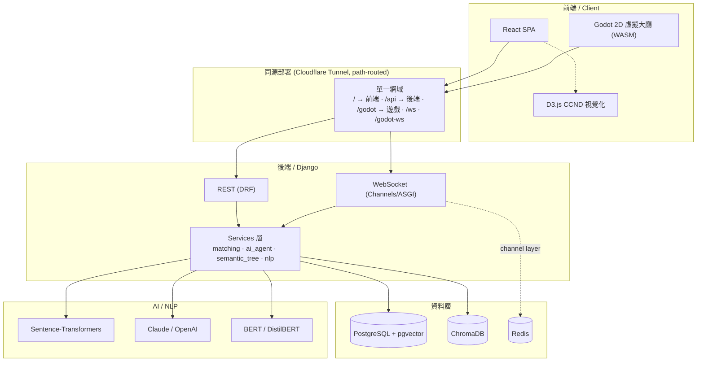
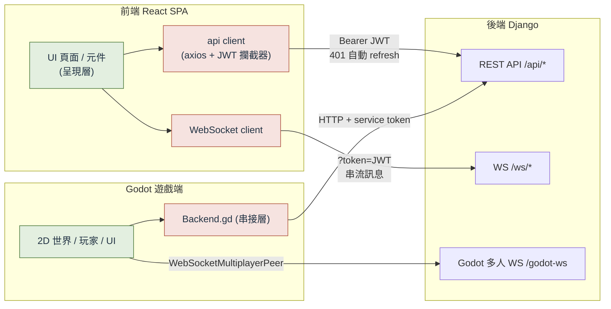
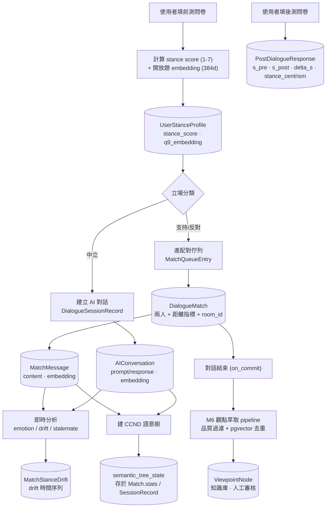
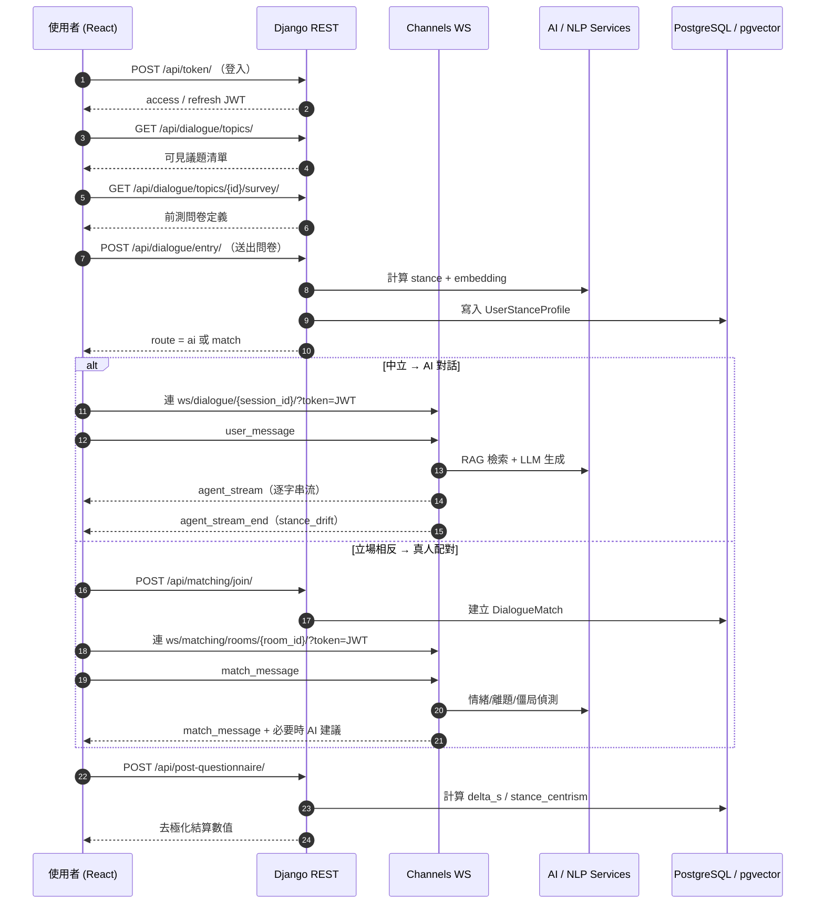
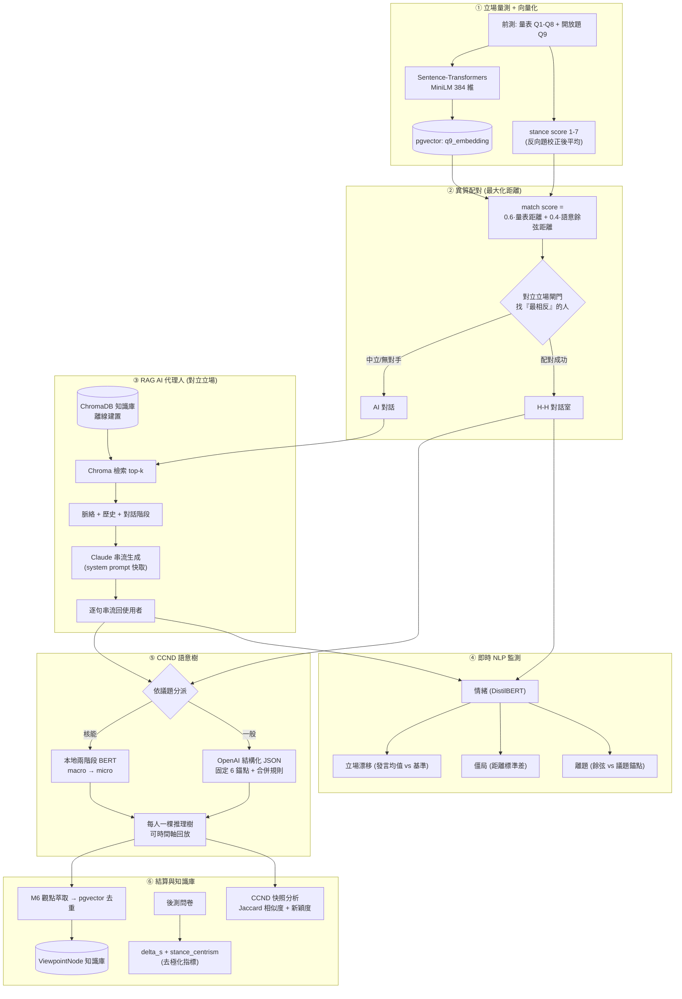
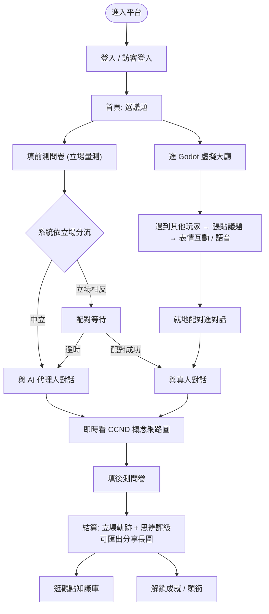

# Architecture · 系統架構與流程

本文件以 Mermaid 圖說明 TakeABridge 的系統架構、前後端關係、資料流、API 流程、AI 流程與使用者操作流程。
所有圖皆為**設計層級**，不含任何原始碼或機密。

---

## 1. 系統架構（Layered Overview）

**分層原則**：前端只透過 HTTP / WebSocket 與後端溝通；後端把商業邏輯集中在 Services 層；向量資料（每則發言 embedding）與業務資料同存 PostgreSQL（pgvector），RAG 靜態知識庫獨立放 ChromaDB。

---

## 2. Frontend / Backend 關係

> 🟩 綠色 = 前端 UI / Godot 世界（**我負責**）　🟥 紅色 = 前後端串接層（**非我負責**）
>
> - 前端把「呈現」與「串接」分離：頁面/元件只管畫面，所有 REST/WS 呼叫集中在 `api client`。
> - `api client` 用攔截器統一加上 JWT，遇 401 會自動呼叫 refresh、去重複並重試。
> - Godot 對後端的呼叫全部收斂在單一 `Backend.gd` 接縫；沒有後端時遊戲仍可本地遊玩。

---

## 3. Database Flow（資料如何流動）

**重點**：立場向量（`q9_embedding`）、每則發言向量（`embedding`）、觀點向量（`ViewpointNode.embedding`）全是同一 384 維空間、同存 pgvector，讓「配對距離」「立場漂移」「觀點去重」都能用 SQL 端的 `CosineDistance` 直接算。

---

## 4. API Flow（一次對話的請求時序）

完整端點清單見 [`API.md`](./API.md)。

---

## 5. AI Flow（去極化的 AI 管線）

設計理由（為何本地 embedding、pgvector vs ChromaDB 分工、為何「最大化距離」）見 [`TECHNICAL_OVERVIEW.md`](./TECHNICAL_OVERVIEW.md#ai-流程與設計理由)。

---

## 6. 使用者操作流程（User Journey）

> 綠色路徑（前端頁面呈現、CCND 視覺化、結算畫面、成就、Godot 大廳互動）為**我負責**的部分；分流、配對、AI 生成、結算數值計算由後端負責。
