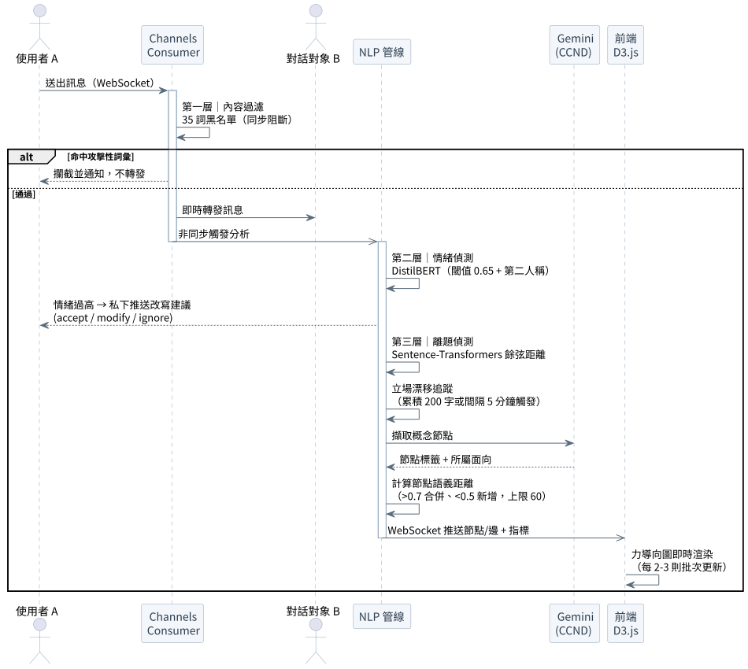

# 技術架構

本文件說明 TakeABridge 整體的技術架構——五個層級如何分工、即時對話與 NLP 分析怎麼串接、資料如何存放。屬團隊整體設計說明。

---

## 一、整體分層


系統由上而下分為五層：

| 層級 | 內容 | 職責 |
|---|---|---|
| 客戶端 | React 19 前端（D3.js CCND 視覺化）、Godot 4.7 虛擬大廳 | 使用者介面、對話與思維圖呈現、2D 互動空間 |
| 接入層 | Django REST Framework + Simple JWT、Django Channels（ASGI） | HTTP API、身分驗證、WebSocket 雙向通訊 |
| 應用模組 | M1 使用者、M2 立場量測、M3 配對、M4 對話室、M5 NLP/CCND、M6 摘要/知識庫 | 各業務邏輯 |
| AI / NLP 服務 | Claude Sonnet、Gemini、Sentence-Transformers、DistilBERT、LangChain | 對話生成、概念擷取、語義向量、情緒偵測、RAG |
| 資料層 | PostgreSQL 16 + pgvector、ChromaDB、Redis 7 | 結構化資料 + 語義向量、RAG 知識向量、快取與訊息代理 |

前端透過 **HTTP** 打 REST API（登入、問卷、報告等一次性請求），透過 **WebSocket** 維持對話室的即時雙向連線；Godot 大廳同樣以 WebSocket 與後端同步位置與標籤互動。

---

## 二、為什麼這樣選型

- **pgvector 與 ChromaDB 分工**：對話中動態產生的語義向量（384 維）存 PostgreSQL，與帳號、對話紀錄等業務資料同庫，配對距離、立場漂移、觀點檢索都能直接用 SQL 混合向量查詢，不必跨系統整合；RAG 用的靜態外部知識（政府資料、學術報告）另存 ChromaDB，各司其職。
- **WebSocket（Channels + Redis）**：對話訊息、NLP 分析結果、CCND 更新都需要毫秒級的即時雙向推送。每個對話房間對應一個獨立的 Channel Group，透過 Redis 作為 Channel Layer 分發訊息，確保多組對話同時進行時的訊息隔離。
- **本地 Sentence-Transformers**：語義向量在本地端計算，低延遲、支援多語、無 API 成本；只有對話生成（Claude）與概念擷取（Gemini）走外部 LLM API。
- **同步阻斷 vs 非同步分析分流**：內容過濾（攻擊性詞彙黑名單）走同步、零延遲攔截；情緒／離題／CCND 等較重的分析走非同步，不阻塞訊息傳遞。

---

## 三、即時對話與 NLP 分析管線

對話室是系統最核心的即時互動。一則訊息從送出到 CCND 更新，會經過一條三層分析管線：



1. **第一層｜內容過濾（同步）**：對每則訊息以 35 詞攻擊性黑名單做字串比對，命中直接攔截、通知發送者、不轉發，零延遲。
2. **第二層｜情緒偵測（非同步）**：DistilBERT 多語言情緒模型計算 negative-class 機率，閾值 0.65 且訊息含第二人稱時（區分「批評議題」與「攻擊人」），私下向發送者推送改寫建議，由使用者決定 accept / modify / ignore——採建議而非強制。
3. **第三層｜離題與漂移**：Sentence-Transformers 取近 3 則發言的語義向量均值，與議題錨點向量算餘弦距離，超過閾值觸發回題引導；同時持續追蹤發言向量相對初始立場的漂移。累積條件為雙方字數達 200 字或間隔 5 分鐘先到先觸發。
4. **CCND 生成**：Gemini 從訊息擷取概念節點（標籤 + 所屬面向），Sentence-Transformers 計算節點語義距離（相似度 > 0.7 合併、< 0.5 新增、上限 60 個節點），再透過 WebSocket 推送節點與邊，由 D3.js 力導向圖每 2–3 則批次渲染一次。

---

## 四、異質配對演算法

兩階段設計：

1. **分池**：依李克特量表加權總分將使用者分為支持池（> 4.0）、反對池（< 3.0）、中立池（3.0–4.0）。
2. **跨池配對**：在支持池與反對池的跨池候選人中，以加權距離公式取最大值配對：

   ```
   異質度 = 0.6 × 歸一化李克特距離 + 0.4 × 歸一化語義距離
   ```

中立池使用者不進真人佇列，直接由系統生成對立立場的 AI 代理人。配對成功後透過 WebSocket 通知雙方跳轉對話室。

---

## 五、AI 對話代理人（H-AI）

以 Anthropic Claude Sonnet 實作，分三部分：

- **立場校準**：依問卷立場分數鏡像生成對立立場參數，注入 System Prompt，確保全程維持一致對立立場。
- **RAG 知識注入**：LangChain 串接 ChromaDB，以使用者訊息為查詢向量檢索外部權威資料，依「量化數據 > 案例 > 專家意見 > 法規條文」優先序組裝進 Prompt。
- **三階段對話策略**：後端依語義距離變化自動判定 engagement → confrontation → convergence，動態切換回應風格；交鋒階段導入「視角翻轉提問」，給使用者具體決策困境以觸發自我說服。

> 選型註記：開發初期評估過 Gemini Flash 以降低成本，但在多重約束的複雜 Prompt（立場維持、提問格式、階段切換）上指令遵循不穩定，實測指令遵循評分約 45–50/100，明顯低於 Claude Sonnet 的 85–90/100，故生產環境選定 Claude Sonnet。

---

## 六、資料庫設計

以 PostgreSQL 16 實作，資料表依功能分為五個群組：

| 群組 | 主要資料表 | 存什麼 |
|---|---|---|
| 使用者與權限 | Django 內建 `auth_*` | 帳號、群組、後台權限 |
| 立場量測與配對 | `api_ustanceprofile`、`api_matchqueueentry`、`api_dialoguematch`、`api_matchstancedrift` | 問卷回答、立場分數與語義向量、配對佇列、配對結果、立場漂移 |
| H-H 對話 | `chat_conversation`、`chat_message`、`api_matchsuggestion` | 對話房間、每則訊息（含情緒分數與語義向量）、AI 介入建議 |
| H-AI 對話 | `api_aiconversation`、`api_dialoguesessionrecord` | 每輪人機對話、session 語境與語意樹狀態 |
| 系統輔助 | `django_session`、`django_admin_log`、`django_migrations` 等 | session、後台紀錄、遷移版本 |

重點設計：對話語義向量與業務資料同存 PostgreSQL（pgvector），讓配對距離、立場漂移、觀點檢索都能直接用資料庫的向量運算完成。

---

## 七、部署

開發環境以 Docker Compose 容器化 PostgreSQL（含 pgvector）、Redis、ChromaDB 三項服務，確保團隊環境一致。正式環境部署於學校機房，以 Daphne 處理 WebSocket、Gunicorn 處理 HTTP，前面經 Cloudflare 提供 CDN 與安全防護。

---

> 使用者實際操作流程見 [USER_FLOW.md](./USER_FLOW.md)。
