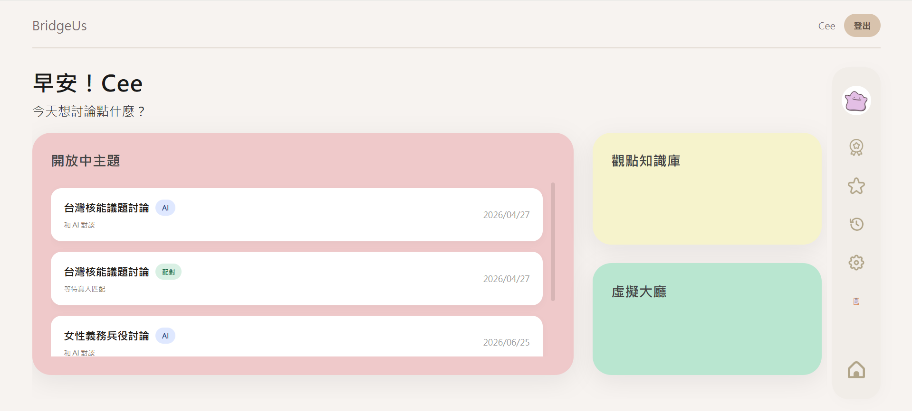
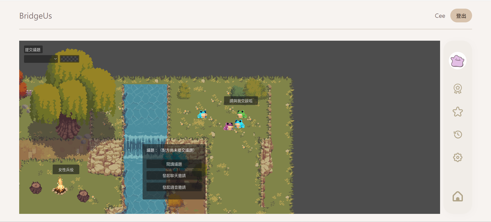

# 我負責的部分

我在團隊中負責前端介面與 Godot 虛擬大廳。這份文件聚焦在我**親手設計與實作、也最能深入說明**的部分：

- **平台主頁大廳**的介面設計與規劃實作
- **Godot 虛擬大廳**的地圖、角色移動、議題發表與標籤互動

---

## 一、主頁大廳（前端）

使用者登入後看到的第一個畫面，是整個平台的入口。我負責它最初的**版面設計與規劃實作**——決定左側議題列表、右側功能入口與工具列的資訊架構，以及從這裡進入各功能（立場問卷、對話室、觀點知識庫、Godot 虛擬大廳）的動線安排。

---

## 二、Godot 虛擬大廳

用 Godot 4.7 打造的像素風 2D 多人空間，讓使用者用輕鬆的方式接觸不同立場。我負責其中的地圖、角色移動，以及議題發表與標籤互動。

### 2-1 地圖與角色移動

以 TileMap 搭建像素風地圖，地圖依議題分成不同區域；玩家操控像素分身，用方向鍵在地圖上自由走動探索。

### 2-2 發表議題與標籤互動

玩家可以在虛擬空間發表自己對議題的想法，以頭頂泡泡呈現給周圍的人；對別人發表的內容，用表情標籤快速表態，不用打長篇回覆。

---

> 完整平台在做什麼、我的部分接在整體的哪裡，見 [README.md](./README.md) 與 [USER_FLOW.md](./USER_FLOW.md)。
