# Database Schema · ER Diagram

> ℹ️ **System Context（非本人作品）**：資料庫 schema 屬**後端團隊**的設計，放這裡是為了呈現整體系統與我理解全貌。我負責前端呈現與 Godot，不含資料庫設計。我的作品見 [`CONTRIBUTIONS.md`](./CONTRIBUTIONS.md)。

TakeABridge 以 **PostgreSQL 16 + pgvector** 為主資料庫：業務資料與對話語意向量同存一庫，方便用 SQL 端向量運算做配對、立場漂移與觀點去重。RAG 靜態知識庫另置於 ChromaDB（不在下列關聯式表中）。

- `USER` 指 Django 內建 `auth.User`
- 所有 embedding 欄位皆為 pgvector `VectorField(384)`，對應多語 MiniLM 編碼器，跨表可直接比對
- `topic_id` 為程式內議題設定的整數鍵，非資料表（故 ER 圖中無 `Topic` 表）

> 本頁為 schema 設計層級說明，不含原始碼或機密。

---

## App `api` — 對話 / 配對 / 問卷 / 社交

| Table | 用途 | 關鍵欄位 | 關聯 |
|---|---|---|---|
| **AIConversation** | 一回合人—AI 對話 | `session_id`, `topic_id`, `user_prompt`, `ai_response`, `embedding(384)` | `user` → USER |
| **DialogueSessionRecord** | AI 對話可續接狀態快照 | `session_id`(unique), `session_state`, `semantic_tree_state`, `status` | `user` → USER |
| **UserStanceProfile** | 使用者前測立場（配對輸入）| `topic_id`, `stance_score`(1–7), `stance_category`, `q9_embedding(384)` | `user` → USER；每 (user, topic) 唯一 |
| **DialogueMatch** | 兩人配對對話室 | 兩人分數, `likert_distance`, `semantic_distance`, `match_score`, `room_id`, `topic_anchor_embedding(384)`, `stats` | `user_a`/`user_b` → USER |
| **MatchQueueEntry** | 配對佇列中的名額 | `topic_id`, `stance_score`, `status` | `user`→USER, `profile`→UserStanceProfile, `match`→DialogueMatch |
| **MatchMessage** | 配對室內訊息 | `content`, `emotion_score`, `embedding(384)` | `match`→DialogueMatch, `sender`→USER |
| **MessageReaction** | 對 AI/配對訊息的讚/倒讚 | `target_type`(ai/match), `target_id`, `value`(±1) | `user`→USER；多型指向（無 DB FK）|
| **MatchAISuggestion** | 對話中給的 AI 建議與採用情況 | `category`, `suggested_content`, `user_action`, `trigger_score` | `match`→DialogueMatch, `user`→USER |
| **MatchStanceDrift** | 對話中立場漂移時間序列 | `drift_value`, `measured_at` | `match`→DialogueMatch, `user`→USER |
| **PostDialogueResponse** | 後測問卷 + 計算後的去極化指標 | 8 題後測量表、`experiment_condition`, `s_pre`, `delta_s_value`, `stance_centrism_value` | `user`→USER |
| **DiscomfortReport** | 不適回報細節 | `detail` | `response`→PostDialogueResponse (1:1) |
| **PlatformFeedback** | Part-F 平台 UX 問卷 | `ux_*`, `nps_score`, `ux_improvement` | `response`→PostDialogueResponse (1:1) |
| **Issue** | 使用者張貼的議題 | `title`, `body`, `stance`, `emotion` | `author`→USER |
| **IssueReaction** | 讀者對議題的表情（可覆蓋）| `emoji_index` | `issue`→Issue, `reactor`→USER；每 (issue, reactor) 唯一 |
| **Title** | 頭銜定義 | `name`(unique), `color` | 被 UserTitle 引用 |
| **UserTitle** | 使用者擁有的頭銜 | `unlocked_at`, `is_selected`, `color` | `user`→USER, `title`→Title（USER↔Title 的 through）|
| **CCNDTimelineUnlock** | 研究者解鎖某人的 CCND 時間軸 | `kind`, `conversation_id`, `reason` | `user`→USER, `granted_by`→USER |
| **PlatformDisplaySetting** | 全站設定（單例 pk=1）| `participant/researcher_entry_mode`, `match_fallback_timeout_minutes` | `updated_by`→USER |
| **TopicDisplayOverride** | 各議題顯示/門檻覆蓋 | `topic_id`(unique), 可見性, `support/oppose_threshold` | `updated_by`→USER |
| **DialogueEntryAssignment** | 記錄使用者被分到 AI 或真人（實驗稽核）| `topic_id`, `route`, `stance_score` | `user`→USER；每 (user, topic) 唯一 |

## App `apps.summary` — M6 觀點知識庫

| Table | 用途 | 關鍵欄位 | 關聯 |
|---|---|---|---|
| **DialogueSummary** | 完成對話的摘要 | `dialogue_id`, `topic_id`, `summary_text`, `quality_score`, `stance_shift_magnitude` | 被 ViewpointNode 引用；`dialogue_id` 為軟參照 |
| **ViewpointNode** | 萃取、評分、審核過的觀點 | `dimension`, `speaker_side`, `viewpoint_summary`, `embedding(384)`, `composite_score`, `citation_count`, `review_status` | `summary`→DialogueSummary, `reviewed_by`→USER |
| **VideoRecommendation** | 後台精選影片 | `title`, `url`, `topic_id`, `is_published` | 無（獨立表）|

---

## ER Diagram（核心表）

```mermaid
erDiagram
    USER ||--o{ AI_CONVERSATION : has
    USER ||--o{ USER_STANCE_PROFILE : declares
    USER ||--o{ DIALOGUE_MATCH : "user_a"
    USER ||--o{ DIALOGUE_MATCH : "user_b"
    USER ||--o{ MATCH_QUEUE_ENTRY : joins
    USER ||--o{ MATCH_MESSAGE : sends
    USER ||--o{ POST_DIALOGUE_RESPONSE : submits
    USER ||--o{ DIALOGUE_ENTRY_ASSIGNMENT : "routed by"
    USER ||--o{ ISSUE : authors
    USER ||--o{ USER_TITLE : owns

    USER_STANCE_PROFILE ||--o{ MATCH_QUEUE_ENTRY : "queued as"
    DIALOGUE_MATCH ||--o{ MATCH_QUEUE_ENTRY : "resolves"
    DIALOGUE_MATCH ||--o{ MATCH_MESSAGE : contains
    DIALOGUE_MATCH ||--o{ MATCH_AI_SUGGESTION : "coached by"
    DIALOGUE_MATCH ||--o{ MATCH_STANCE_DRIFT : tracks

    POST_DIALOGUE_RESPONSE ||--o| DISCOMFORT_REPORT : "may flag"
    POST_DIALOGUE_RESPONSE ||--o| PLATFORM_FEEDBACK : "rated by"

    TITLE ||--o{ USER_TITLE : "granted as"
    ISSUE ||--o{ ISSUE_REACTION : receives
    USER ||--o{ ISSUE_REACTION : reacts

    DIALOGUE_SUMMARY ||--o{ VIEWPOINT_NODE : distills
    USER ||--o{ VIEWPOINT_NODE : reviews

    MESSAGE_REACTION }o..o{ AI_CONVERSATION : "polymorphic target"
    MESSAGE_REACTION }o..o{ MATCH_MESSAGE : "polymorphic target"
    DIALOGUE_SUMMARY }o..o{ DIALOGUE_MATCH : "soft ref (dialogue_id)"
```

### 圖示說明
- 虛線（`}o..o{`）= **軟參照**：`MessageReaction.target_id` 指向 AI 回合或配對訊息其一；`DialogueSummary.dialogue_id` 存 AI session id 或配對 id，皆非真正的 DB ForeignKey。
- 為保持可讀，省略了設定/單例表（`PlatformDisplaySetting`、`TopicDisplayOverride`）、研究者覆蓋（`CCNDTimelineUnlock`）與 `VideoRecommendation`，它們僅各帶一個可選的 `updated_by`/`granted_by`/`reviewed_by` → USER。
- `topic_id` 全程為程式內議題設定的整數鍵，非資料表。

---

## 設計亮點

1. **向量與關聯資料同庫（pgvector）**：立場向量、每則發言向量、觀點向量都是同一 384 維空間，讓配對距離、立場漂移、觀點去重都能用 SQL 端 `CosineDistance` 直接算，避免第二套一致性邊界。
2. **pgvector 與 ChromaDB 分工**：動態、每回合變動的使用者向量放 pgvector；靜態、離線建置的 RAG 知識語料放 ChromaDB。
3. **多型 reaction / 軟參照 summary**：用 `target_type + target_id` 讓「讚/倒讚」「對話摘要」同時服務 AI 與真人兩種對話，不必為每種對話各開一套表。
4. **實驗稽核可追溯**：`DialogueEntryAssignment`、`MatchStanceDrift`、`PostDialogueResponse` 完整記錄「誰被分到哪、立場怎麼變」，支撐研究分析。
