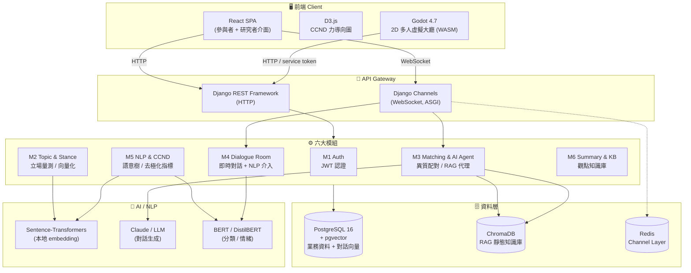

# TakeABridge（橋得攏 · BridgeUs）— System Design Portfolio

> 一個對抗同溫層、促進「異質觀點對話」的去極化對話平台。
> 本 repository 為**系統設計作品集**，只展示架構與設計，**不含任何原始碼與商業機密**。

  <em>Heterogeneous-viewpoint dialogue platform · React · Django · Godot · RAG / NLP</em>

---

## 目錄

| 文件 | 內容 |
|---|---|
| [`README.md`](./README.md) | 專案總覽、系統架構圖、技術棧、我的負責範圍（本頁）|
| [`ARCHITECTURE.md`](./ARCHITECTURE.md) | 系統架構、前後端關係、Database Flow、API Flow、AI Flow、使用者操作流程（全 Mermaid）|
| [`API.md`](./API.md) | 完整 REST / WebSocket API 對照表 |
| [`DATABASE.md`](./DATABASE.md) | Database Schema、ER Diagram、各表用途與關聯 |
| [`TECHNICAL_OVERVIEW.md`](./TECHNICAL_OVERVIEW.md) | 面試用技術總覽（目的 / 架構 / 技術選型理由 / AI / API / DB / 我的貢獻）|
| [`learning.md`](./learning.md) | 給自己看的超詳細架構筆記 |

---

## 專案簡介

**TakeABridge** 是一個異質觀點對話平台，目標是對抗回聲室效應與社會極化。系統會依「立場向量」把**立場相反**的使用者配對在一起，透過結構化的去極化對話（真人—真人、真人—AI 代理人）促進彼此理解，並用**概念認知網路圖（CCND, Conceptual Cognitive Network Diagram）**即時視覺化每個人推理脈絡的擴張。

- **性質**：國科會（NSTC）大專學生研究計畫（115 年度）
- **核心假設**：與具備高品質知識架構、無情緒干擾的 AI 對話，能達到與真人異質對話同等甚至更穩定的去極化效果。

### 核心功能

- 🧭 **立場量測與向量化**：李克特量表 + 開放式問卷 → 連續立場分數（1–7）+ 語意向量（384 維）
- 🔀 **異質配對**：以「最大化立場距離」為目標，把立場最相反、語意最不同的人配在一起
- 🤖 **RAG AI 代理人**：以 ChromaDB 知識庫為依據，扮演對立立場與使用者對話
- 💬 **即時對話室**：WebSocket 串流；即時偵測情緒強度、離題、僵局並給提示
- 🕸️ **CCND 概念認知網路圖**：把每個人的推理脈絡建成語意樹，可時間軸回放
- 📊 **去極化結算**：立場偏移量、去極化指標、思辨投入評級
- 🎮 **Godot 虛擬大廳**：2D 多人社交世界，玩家張貼議題、表情互動、語音聊天
- 📚 **觀點知識庫**：把高品質觀點沉澱成可瀏覽、可人工審核的知識庫

---

## 系統架構總覽

> 詳細的前後端關係、資料流、API 流程、AI 流程與使用者操作流程，見 [`ARCHITECTURE.md`](./ARCHITECTURE.md)。

---

## 技術棧

| 層級 | 技術 |
|---|---|
| **前端** | React 19 · Vite · React Router · D3.js（CCND 視覺化）· html-to-image |
| **遊戲端** | Godot 4.7（GL Compatibility）· WebSocketMultiplayerPeer · WASM Web export |
| **後端** | Python 3.11 · Django 5 · Django REST Framework · Django Channels（ASGI）|
| **即時** | WebSocket · Redis（Channel Layer）|
| **資料庫** | PostgreSQL 16 + **pgvector**（對話語意向量）· ChromaDB（RAG 知識庫）|
| **AI / NLP** | Sentence-Transformers（多語 MiniLM, 384 維）· Claude / OpenAI · 本地微調 BERT（節點分類）· DistilBERT（情緒）· LangChain（RAG 串接）|
| **認證** | JWT（SimpleJWT）|

技術選型理由見 [`TECHNICAL_OVERVIEW.md`](./TECHNICAL_OVERVIEW.md#技術選型理由)。

---

## 六大模組

| 模組 | 名稱 | 說明 |
|---|---|---|
| **M1** | User Auth | JWT 認證、註冊/登入、帳號管理、表面匿名實質具名 |
| **M2** | Topic & Stance | 議題選擇、量表 + 開放式問卷、Sentence-Transformers 立場向量化、stance score 計算 |
| **M3** | Matching & AI Agent | 立場向量異質配對（歐氏 + 餘弦距離）、RAG 對立立場 AI 代理人生成 |
| **M4** | Dialogue Room | Channels WebSocket 即時對話、回應長度限制、離題偵測、情緒閾值冷靜提示 |
| **M5** | NLP & CCND | 語意距離計算、概念認知網路圖、D3 力導向圖即時渲染、WebSocket 推送 |
| **M6** | Summary & KB | 對話摘要、立場偏移量化報告、情緒分數變化、觀點知識庫沉澱 |

---

## 🙋 我的負責範圍

> 這是團隊研究專案。以下**只列出我實際負責的部分**，其餘（後端、AI/NLP、資料庫、以及所有前後端串接）由團隊其他成員負責。

### ✅ 我負責

**1. 前端 UI / UX / 視覺化（React）**
- 參與者與研究者介面的版面、元件、視覺設計與互動
- CCND 概念網路圖的 **D3.js 力導向圖**呈現（`ConversationTreePanel`）
- 成就系統介面（成就頁、解鎖 toast）
- 對話結算畫面視覺化（信封開封動畫、收據式立場軌跡 / 雷達圖 / 甜甜圈，可匯出 PNG）
- 首頁、知識庫、歷史紀錄等頁面的呈現層

**2. Godot 2D 虛擬大廳（遊戲端）**
- 2D 多人社交世界的場景、玩家與介面（player node ↔ UI CanvasLayer 分層）
- 議題張貼與 5 種表情回應系統、頭頂泡泡、邀請/聊天互動
- 語音聊天的本地音訊 DSP（變聲 / 殘響 / 頻譜視覺化）
- 網頁嵌入的顯示與大廳 UX

### 🚫 我不負責（由團隊其他成員 / 後端負責）

- **前端 ↔ 後端串接**：API client、JWT 換發、WebSocket 接線、資料抓取邏輯
- **Godot ↔ 後端串接**：`Backend.gd` 對 Django 的呼叫
- 後端（Django / DRF / Channels）、AI / RAG / NLP、資料庫與配對演算法

> 在 [`ARCHITECTURE.md`](./ARCHITECTURE.md) 與 [`learning.md`](./learning.md) 中，凡屬「串接 / 後端」的部分皆有標註，以清楚區分我的貢獻與整體系統。

---

## 授權與說明

本 repository 僅含系統設計文件與架構圖，**不包含任何原始碼、金鑰、資料或商業機密**，用於個人作品集展示。實際程式碼存放於團隊私有 repository。
