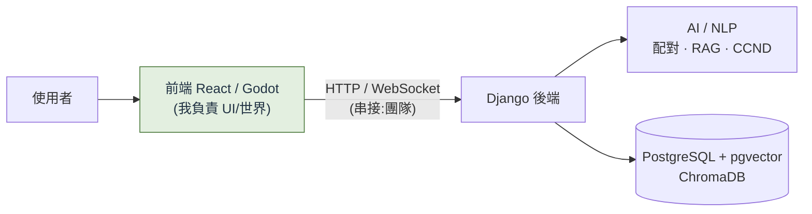

# TakeABridge（橋得攏 · BridgeUs）

> 一個對抗同溫層、促進「異質觀點對話」的去極化對話平台。
> 這個 repo 是我的**作品集**，聚焦展示**我負責的前端 UI/UX 與 Godot 2D 世界**；不含原始碼與機密。

  <em>React · D3.js · Godot 4.7 · 前端視覺化 · 遊戲互動</em>

**我在這個團隊研究專案負責：前端使用者介面 / 視覺化，以及 Godot 2D 虛擬大廳。**
（後端、AI/NLP、資料庫、以及所有前後端串接由其他成員負責——見 [🙋 我的角色界線](#-我的角色界線)。）

---

## 🎯 我做的東西（重點看這裡）

### 1. 對話結算畫面 — 信封開封 → 收據式數據視覺化 → 匯出分享長圖

> 🖼️ _[截圖位：`assets/settlement-envelope.png` 信封 + `assets/settlement-receipt.png` 收據結算頁 — 建議放一張開封前、一張開封後]_

使用者對話結束、填完後測後，跳出一個**信封**，點擊有**開封動畫**，滑出「收據 / 明細」風格的結算：
- 立場軌跡（1–7 刻度尺，對話前 → 對話後，數字跳動動畫）
- 思辨投入**雷達圖**、讚/倒讚**甜甜圈**
- 一鍵**匯出整份長圖 PNG** 給使用者分享

**亮點**：圖表全**手刻 inline SVG**（不裝圖表套件、配色過無障礙色彩驗證）；評級**刻意只看「思辨投入」不看立場方向**，避免獎勵使用者為分數改立場而污染實驗數據。→ [看 case study](./CONTRIBUTIONS.md#case-1--對話結算畫面)

### 2. CCND 概念認知網路圖 — D3.js 力導向圖

> 🖼️ _[截圖位：`assets/ccnd-graph.png` — CCND 力導向圖展開狀態]_

把後端算出的「語意樹」（一個人的推理脈絡）用 **D3.js 力導向圖**畫成可縮放、有層次的網路圖，讓抽象的推理結構變成使用者一眼看得懂的視覺。→ [看 case study](./CONTRIBUTIONS.md#case-2--ccnd-概念網路圖視覺化)

### 3. Godot 2D 虛擬大廳 — 多人社交世界

> 🖼️ _[截圖位：`assets/godot-lobby.png` 世界全景 + `assets/godot-issue.png` 頭頂議題/表情互動]_

Godot 4.7 做的 2D 多人世界：玩家相遇、在頭上張貼議題、用 5 種表情回應、發起聊天、語音互動。核心架構決定：**RPC 掛在玩家節點、UI 只做本地呈現**。→ [看 case study](./CONTRIBUTIONS.md#case-3--godot-2d-虛擬大廳架構)

### 4. 成就系統 UI

> 🖼️ _[截圖位：`assets/achievement.png` 成就牆 + 解鎖 toast]_

成就牆、頭銜、解鎖 toast 通知。

📌 **更多細節與技術決策 → [`CONTRIBUTIONS.md`](./CONTRIBUTIONS.md)（我的 case studies）**

---

## 🧰 技術棧（粗體 = 我實際用到）

| 層級 | 技術 |
|---|---|
| **我的前端** | **React 19** · **Vite** · **React Router** · **D3.js（CCND 視覺化）** · **inline SVG 圖表** · **html-to-image（匯出 PNG）** |
| **我的遊戲端** | **Godot 4.7**（GL Compatibility）· 場景/節點/UI · 音訊 DSP · WASM Web export |
| 後端（團隊）| Python · Django · DRF · Django Channels |
| 資料 / AI（團隊）| PostgreSQL + pgvector · ChromaDB · Sentence-Transformers · Claude · BERT · LangChain |

---

## 🙋 我的角色界線

> 團隊研究專案（國科會大專生計畫）。以下清楚區分，避免誤導。

**✅ 我負責**
- **前端 UI / UX / 視覺化**：頁面呈現、元件、CCND 的 D3 視覺化、結算畫面（動畫 + 匯出）、成就系統
- **Godot 2D 虛擬大廳**：世界/玩家/UI、議題與表情互動、語音 DSP、大廳顯示

**🚫 我不負責（其他成員 / 後端）**
- 前端 ↔ 後端串接（API client、JWT、WebSocket 接線、資料抓取）
- Godot ↔ 後端串接（`Backend.gd`）
- 後端（Django/DRF/Channels）、AI/RAG/NLP、資料庫、配對演算法

---

## 📚 System Context（整體系統 — 幫助理解全貌，多為團隊後端作品）

> 以下文件描述**整個平台**的設計，讓你理解我的部分接在哪。**大部分屬後端/AI 團隊，非我個人作品**，放這裡是為了展現我理解系統全貌。

| 文件 | 內容 |
|---|---|
| [`ARCHITECTURE.md`](./ARCHITECTURE.md) | 系統架構、前後端關係、Database/API/AI Flow、使用者流程（Mermaid）|
| [`API.md`](./API.md) | 完整 REST / WebSocket 對照表（後端團隊）|
| [`DATABASE.md`](./DATABASE.md) | Schema、ER Diagram、各表用途（後端團隊）|
| [`TECHNICAL_OVERVIEW.md`](./TECHNICAL_OVERVIEW.md) | 面試用技術總覽（含技術選型理由）|

### 專案一句話
> 量測你的立場 → 把你和**立場最相反**的人（或對立 AI）配對對話 → 即時把推理畫成概念網路圖 → 對話後用數字證明立場移動了多少 → 好觀點沉澱成知識庫。

---

## 說明
本 repository 僅含系統設計文件、架構圖與（待補的）畫面截圖，**不含任何原始碼、金鑰、資料或商業機密**，用於個人作品集展示。實際程式碼存放於團隊私有 repository。
