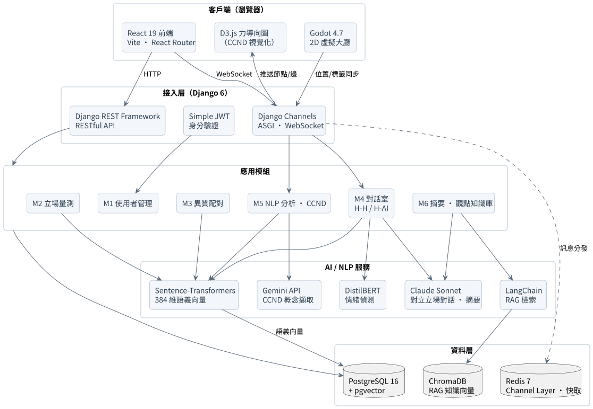

# TakeABridge-橋得攏

一個脫離同溫層、促進異質觀點對話的去極化對話平台，為115學年度資管系畢業專題，目前還未完工，任在實作階段。

本專案**已通過國科會大專學生研究計畫**（計畫編號：115-2813-C-032-043-H），由五人團隊分工開發。此 repo 為系統設計文件與畫面說明，用於呈現整體專題架構。

**本人在此專題中主要負責前端設計以及透過Godot引擎開發的虛擬大廳。**

---

## 這個專題在做什麼

現在的社群平台會一直推你愛看的東西，立場相近的內容越看越多，久了身邊就只剩下同一種聲音——這就是「同溫層」。待久了，看到不同意見容易先動氣，好好講話變得很難，社會也越來越對立。

其實只要在一個匿名、有人幫忙控場、不會失控的環境裡，跟立場不同的人好好聊，是可以緩和這種對立的。但真的要做這件事有三個麻煩：願意跟不同立場的人聊的人本來就難找、聊敏感話題很容易吵起來、而且不是每個人都很會講道理，常常講一講就變成無效爭吵。

TakeABridge 就是為了解決這幾個麻煩做的一套平台，主要有五個做法：

1. **主動幫你配「最不同意你的人」**：你填完一份立場問卷後，系統把你的立場換算成分數，分成支持、反對、中立三群，然後專門把立場差最多的兩個人配在一起聊——而不是又讓你遇到跟你想法一樣的人。

2. **一個專門跟你唱反調的 AI**：不想跟真人聊、或還在等配對時，可以跟一個立場跟你完全相反的 AI 對話。它不是那種中立回答問題的助理，而是會站在對立面跟你辯，而且講的內容都是從真實資料（政府資料、新聞、報告）裡查出來的、不是亂編。它還會反問你「如果換成是你來決定，你會怎麼選？」逼你站到對面的角度想一遍。

3. **把你的想法變化畫成一張看得到的圖（CCND）**：聊天的時候，系統會即時把對話裡出現的概念抓出來，畫成一張會動的網狀圖。隨著你們聊下去，圖上的點會靠近、分開、長出新的，你可以直接「看到」自己的想法有沒有鬆動、有沒有想到新角度。一般聊天室只有一排文字，很難看出自己變了沒；這張圖把它變得看得見。

4. **全程有個隱形主持人幫你顧場**：有人開始人身攻擊，系統會擋下來不讓對方看到；情緒上來了會提醒你冷靜一下；聊歪了會把你拉回主題；兩邊鬼打牆時會提示你換個角度切入。讓敏感話題不會一言不合就吵起來。

5. **把好的對話存起來變成「觀點知識庫」**：聊完之後，系統會挑出那些講得理性、有品質的對話存下來。以後別人想了解某個議題，直接搜一下就能看到各種立場的說法，不用自己親身去吵一架才搞懂。

---

## 換個輕鬆的方式聊：Godot 像素風虛擬大廳

上面那些是「坐下來好好對話」的模式，但不是每個人都想花時間打一長串字。所以平台另外做了一個用 **Godot 遊戲引擎**打造的**像素風 2D 虛擬空間**，給那些習慣滑社群、喜歡輕鬆互動、不一定想深聊的人，一個比較好上手的方式接觸不同立場。

使用者可操控像素風格青蛙在地圖上自由走動，主要可以做這些事：

- **自由漫遊**：用像素分身在虛擬世界中到處走動、靠近別人看他們發表了什麼，像逛街一樣。
- **發表立場**：把自己對議題的想法貼在角色頭頂的泡泡上，路過的人都看得到。
- **一鍵表態**：對別人貼的內容，不用打字回覆，用五種表情標籤（支持、反對等）就能直覺快速表態。
- **熱門議題參考**：系統會用爬蟲去抓公共政策討論平台上正在被討論的熱門議題，當作大家發表時的題目參考。
- **匿名保護**：進去只能選系統給的基礎像素角色、隨機分配一個 ID，看不出你是誰，聊起來比較沒壓力。

整體就是想用「逛街、玩遊戲」那種輕鬆的感覺，讓「接觸不同立場」這件事沒那麼有壓力，也適合沒耐心打長篇對話的人。

---

## 系統架構

技術面分為五層：**客戶端**（React 前端 + D3.js CCND 視覺化、Godot 虛擬大廳）、**接入層**（Django REST + JWT、Django Channels WebSocket）、**應用模組**（M1~M6）、**AI/NLP 服務**（Claude、Gemini、Sentence-Transformers、DistilBERT、LangChain）、**資料層**（PostgreSQL + pgvector、ChromaDB、Redis）。

完整說明見 [ARCHITECTURE.md](./ARCHITECTURE.md)；使用者從登入到對話結束的操作流程見 [USER_FLOW.md](./USER_FLOW.md)。

**我在這個專題負責的部分（前端主頁大廳 + Godot 虛擬大廳）見 [CONTRIBUTIONS.md](./CONTRIBUTIONS.md)。**

---

## 六大模組

| 模組 | 名稱 | 說明 |
|---|---|---|
| M1 | 使用者管理 | JWT 註冊登入、對話匿名機制 |
| M2 | 立場量測 | 議題選擇、李克特量表 + 開放式問卷、立場分數與語義向量計算 |
| M3 | 異質配對 | 立場分池 + 加權距離配對演算法、對立立場 AI 代理人生成 |
| M4 | 對話室 | WebSocket 即時對話（H-H / H-AI）、NLP 即時守護管線 |
| M5 | NLP 分析與 CCND | 概念節點擷取、語義距離計算、D3.js 力導向圖即時渲染 |
| M6 | 摘要與觀點知識庫 | 量化分析報告、對話品質評分、觀點知識庫沉澱與檢索 |

---

## 技術棧

| 層級 | 技術 |
|---|---|
| 前端 | React 19、Vite、React Router、axios、D3.js 7（CCND 力導向圖）|
| 遊戲端 | Godot 4.7（像素風 2D、TileMap、WebSocket 多人同步）|
| 後端 | Python、Django 6、Django REST Framework、Django Channels（ASGI／WebSocket）|
| 資料 | PostgreSQL 16 + pgvector、ChromaDB、Redis 7 |
| AI / NLP | Sentence-Transformers（paraphrase-multilingual-MiniLM-L12-v2，384 維）、Claude Sonnet（對話／摘要）、Gemini（CCND 概念擷取）、DistilBERT（情緒偵測）、jieba、KeyBERT、LangChain（RAG）|
| 測試 / 部署 | pytest、Docker Compose、Daphne + Gunicorn、Cloudflare |

---

內容為系統設計文件與畫面，不含原始碼；程式碼在團隊私有 repo。
