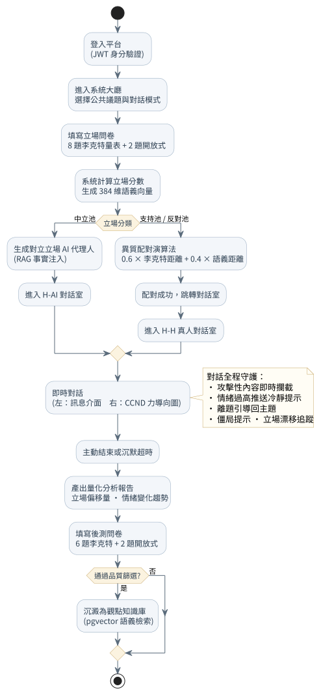
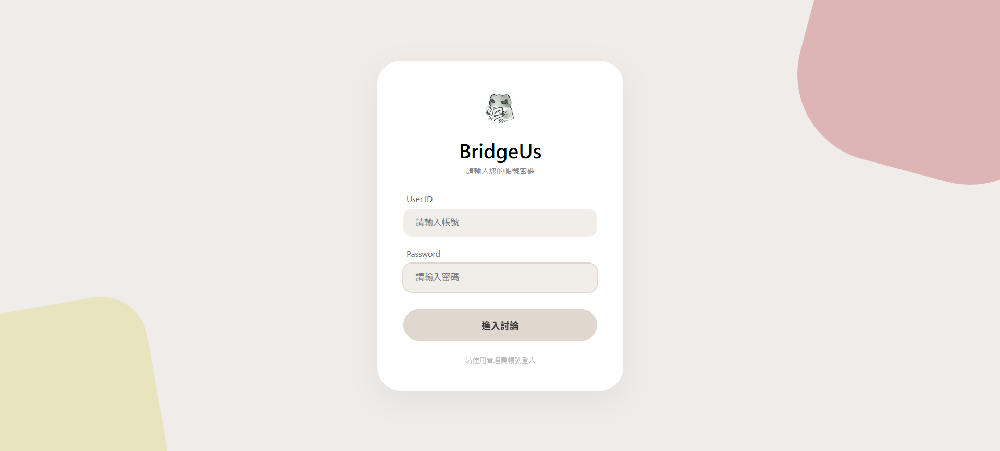
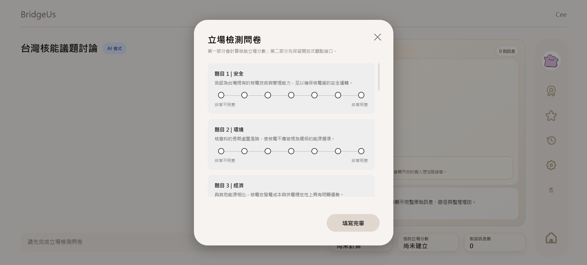
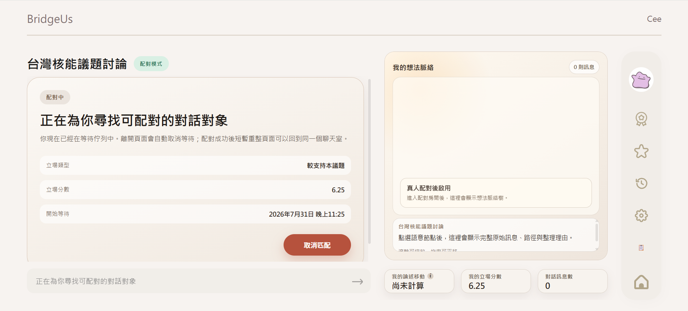

# 使用流程

本文件以一位完整參與 H-H 真人配對模式的使用者為例，說明平台從登入到對話結束的操作流程；文末補充 H-AI 模式與 Godot 虛擬大廳的差異。每一步標出建議附上的畫面截圖。

平台網址：https://dev.bridgeus.work/

---

## 整體流程圖

---

## 一、登入平台

輸入帳號與密碼，點擊「進入討論」完成 JWT 身分驗證，成功後自動跳轉至個人化大廳。全程以帳號 ID 作識別，對話時以匿名身分呈現，不對對方揭露真實帳號。

---

## 二、系統大廳，選議題與模式

大廳左側顯示開放中的討論主題，每個主題標有對話模式標籤——「AI」為 H-AI 模式、「配對」為 H-H 真人配對模式；右側提供觀點知識庫與 Godot 虛擬大廳的快速入口，右上角顯示登入帳號與通知、收藏、設定等工具列。點選欲參與的主題進入前置流程。

---

## 三、填寫立場問卷

進入主題後系統彈出立場檢測問卷。第一部分為李克特量表，依**安全、環境、經濟、替代能源**四個面向作答（7 點量尺，非常不同意 → 非常同意）；第二部分為開放式觀點輸入，說明立場的主要理由。填寫完畢後，系統即時計算立場分數並生成 384 維語義向量，進入配對等待。

---

## 四、等待異質配對

進入等待畫面後可確認系統算出的立場類型與立場分數。系統在背景執行異質配對演算法，搜尋與當前使用者立場最對立的候選人；等待期間可點「取消匹配」返回大廳。右側 CCND 區域於真人配對完成後才啟用，等待期間不顯示對方脈絡。配對成功後頁面自動跳轉至對話室。

---

## 五、進行異質對話（H-H 對話室）

配對成功後進入真人對話室。左側為即時訊息介面，雙方皆以匿名身分對話；右側為概念認知網路圖（CCND），即時呈現使用者自身的思維脈絡節點變化；畫面底部顯示三項即時指標：**立場偏離度、立場分數、對話訊息數**。

---

## 六、對話結束與報告

對話達到最低輪數後，任一方可主動結束；或系統偵測到沉默超時自動結束。結束後：後台執行 LLM 摘要生成與觀點知識庫品質評分，使用者端跳轉至量化分析報告頁面，顯示本次對話的**立場偏移量、情緒分數變化趨勢**等指標，並提示填寫後測問卷（6 題李克特 + 2 題開放式）。

---

## 補充一：H-AI 對話室（AI 代理人模式）

介面與真人對話室相同，差異在對話對象為系統生成的 AI 代理人（標記「AI 模式」）。AI 依使用者問卷結果持對立立場，透過 RAG 引用外部權威資料支撐論述，並隨對話進程動態調整策略（engagement → confrontation → convergence）。右側 CCND 同樣即時更新。中立池使用者會直接進入此模式。

---

## 補充二：觀點知識庫

知識庫提供議題觀點的搜尋與瀏覽。可用關鍵詞搜尋，或從「猜你想搜」標籤快速進入；右側顯示近期熱門議題排行。內容來源為平台上通過品質篩選的歷史對話，經結構化整理後供參考，並以 pgvector 支援語義檢索。

---

## 補充三：Godot 2D 虛擬大廳

一個像素風的多人互動空間，用輕鬆的形式帶來另一種討論方式：

- **像素場景漫遊**：以像素分身在依議題劃分的區塊式地圖自由移動，快速定位感興趣的主題。
- **立場發表**：在虛擬空間中發表對議題的立場與想法，以頭頂泡泡呈現給周圍玩家。
- **標籤式互動**：對他人發表的內容以「支持」「反對」或表情標籤快速表態，無需長篇回覆。
- **去識別化保護**：進入時僅能選用系統提供的基礎像素角色並隨機分配識別 ID，排除個人特徵與帳號連結。

